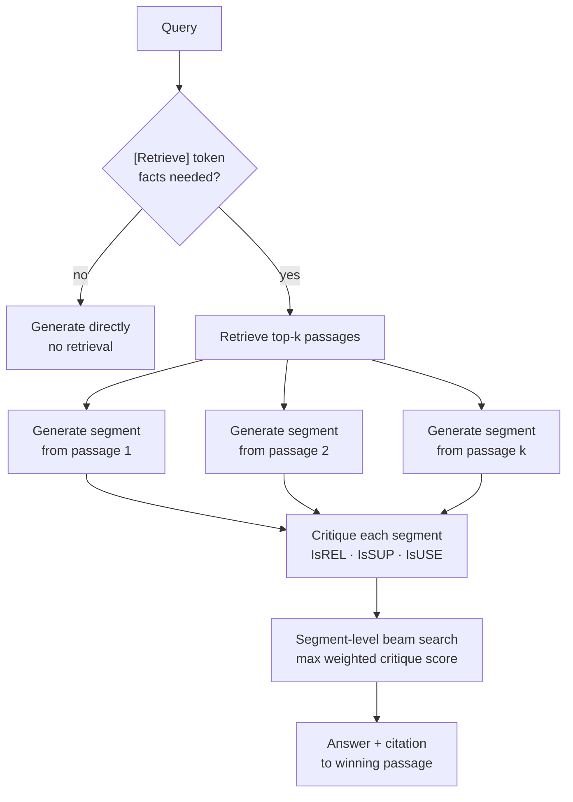

# self-rag-agent

A runnable Python implementation of **Self-RAG** — *"Self-RAG: Learning to Retrieve, Generate, and Critique through Self-Reflection"* (Asai, Wu, Wang, Sil & Hajishirzi, ICLR 2024, [arXiv:2310.11511](https://arxiv.org/abs/2310.11511)).

Conventional RAG retrieves a fixed number of passages for *every* input — even greetings — and never checks whether its answer is actually supported by what it retrieved. Self-RAG fixes both problems with **reflection tokens**: the model itself decides whether to retrieve, judges whether each passage is relevant, grades whether each generated segment is supported by its passage, and rates its overall utility. Segments are then selected by a critique-weighted beam search, with citations attached.

This repo implements the full inference loop from the paper, running **100% offline** with a deterministic lexical retriever, an extractive generator, and a transparent rule-based critic — no API key, no network, no training. An optional OpenAI-compatible generator is included for real runs.

## Setup

Requires Python 3.9+.

```bash
git clone https://github.com/sulaimanvesal/self-rag-agent.git
cd self-rag-agent
pip install -r requirements.txt   # pytest only; the library is stdlib-only
```

## Usage

### Offline demo (no API key, no network)

```bash
python examples/run_demo.py
```

Sample output:

```
Q: How tall is the Eiffel Tower?
  [Retrieve: yes]
  candidate [eiffel] score=3.00 [IsREL:Relevant] [IsSUP:Fully Supported] [IsUSE:5] <-- selected
    The Eiffel Tower stands 330 metres tall and was completed in 1889.
  ANSWER: The Eiffel Tower stands 330 metres tall and was completed in 1889.
  citations: ['eiffel']  fully_supported: True

Q: Hello!
  [Retrieve: no]
  ANSWER: Hello! How can I help you today?
```

### Library

```python
from selfrag import SelfRAG

rag = SelfRAG(k=3)  # top-k passages, generated + critiqued in parallel
result = rag.run("When did humans first land on the Moon?")

print(result.retrieve)            # True  -- the [Retrieve] token decision
print(result.answer)              # winning segment
print(result.citations)           # ['moon']
print(result.converged_supported) # True  -- winner is fully supported
for c in result.candidates:       # every candidate + its reflection tokens
    print(c.passage.id, c.score, c.critique.render(), c.segment)
```

### Real models (optional)

```python
import os
from selfrag import SelfRAG, OpenAILM

rag = SelfRAG(generator=OpenAILM(model="gpt-4o-mini", api_key=os.environ["OPENAI_API_KEY"]))
print(rag.run("How tall is the Eiffel Tower?").answer)
```

Any OpenAI-compatible endpoint works via `base_url=`.

## How it works



One design note: in the paper the generator LM is *trained* to emit reflection tokens (a critic LM labels data offline first). Here the critic is a separate, transparent rule system — same tokens, same selection objective, but every label can be explained from token overlap between query, passage, and segment. That trade-off is deliberate for an educational re-implementation.

## Paper → code mapping

| Paper concept | Where it lives |
|---|---|
| Reflection tokens: Retrieve / IsREL / IsSUP / IsUSE (§2–3) | `selfrag/tokens.py` (`Critique`, score tables) |
| Retrieve on demand, not always (§3, Step 1) | `selfrag/critic.py` (`needs_retrieval`), `pipeline.SelfRAG.run` step 1 |
| Parallel generation, one segment per passage (§3, Step 2) | `pipeline.SelfRAG.run` step 2, `selfrag/generator.py` |
| Critique tokens per segment (§3, Step 3) | `selfrag/critic.py` (`RuleCritic.critique`) |
| Segment-level beam search on critique scores (§3.2) | `selfrag/tokens.py` (`Critique.score`), `pipeline` step 4 |
| Citations / verifiability from IsSUP (§3, Fig. 1) | `SelfRAGResult.citations`, `converged_supported` |
| Retriever-agnostic design (paper uses Contriever) | `selfrag/retriever.py` (`LexicalRetriever`, BM25-flavoured) |
| Conventional RAG baseline (Fig. 1, left) | `selfrag/pipeline.py` (`conventional_rag`) |
| Built-in demo corpus | `selfrag/corpus.py` |

## Tests

```bash
pytest -q
```

Tests cover the reflection-token vocabularies and scoring, the retrieve-on-demand decision (factual vs. greeting/creative inputs), retriever ranking, critic support levels (fully / partially / no support), end-to-end answers with citations, the no-match path, and the conventional-RAG baseline contrast.

## Limitations

- The critic is rule-based, not a trained LM — it demonstrates the token semantics and selection loop, not the paper's learned critique quality.
- The offline generator is extractive (best sentence per passage); fluent abstractive generation requires the optional OpenAI-compatible backend.
- Single-segment answers only; the paper's multi-segment generation with `[Retrieve: continue]` is represented in the token vocabulary but not iterated in the demo loop.

## License

MIT — see `LICENSE`.

## Citation

```bibtex
@inproceedings{asai2024selfrag,
  title     = {Self-RAG: Learning to Retrieve, Generate, and Critique through Self-Reflection},
  author    = {Asai, Akari and Wu, Zeqiu and Wang, Yizhong and Sil, Avirup and Hajishirzi, Hannaneh},
  booktitle = {International Conference on Learning Representations (ICLR)},
  year      = {2024},
  note      = {arXiv:2310.11511}
}
```
